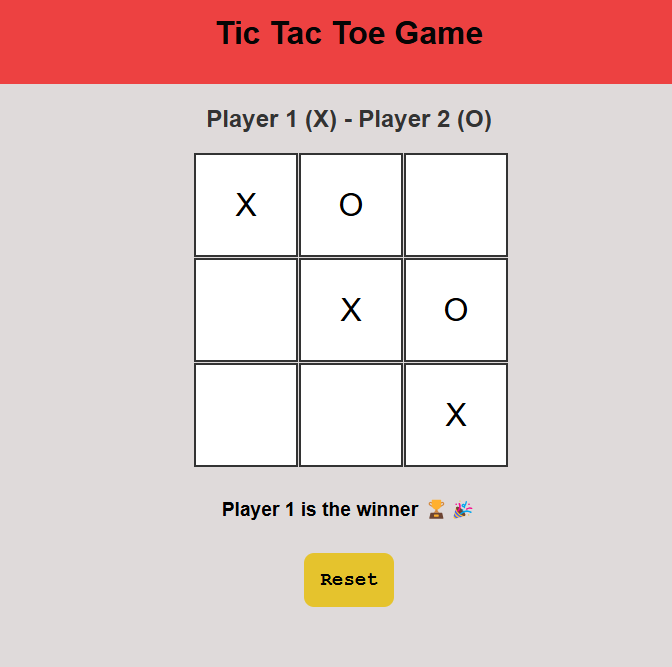
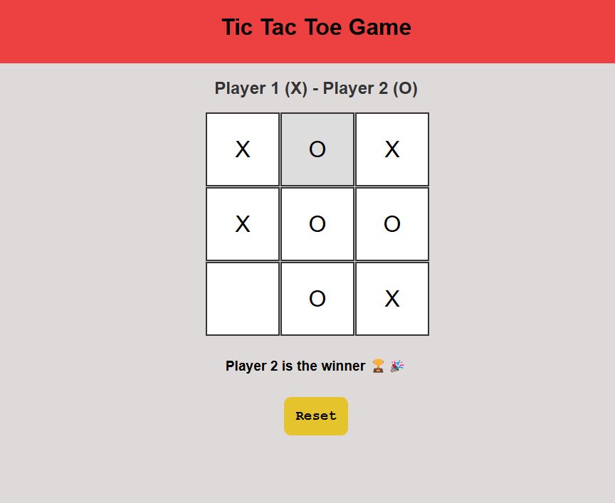
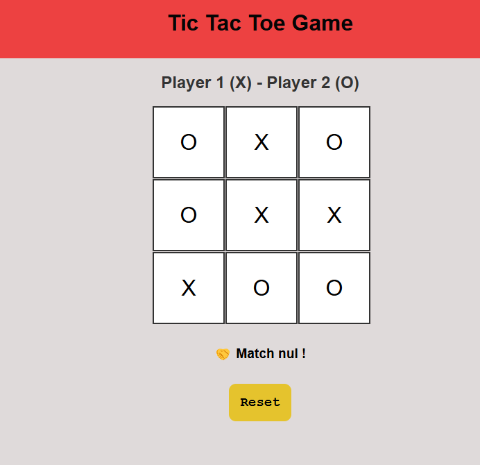

# Tic Tac Toe Game
Ce projet est réalisé dans le cadre du parcours Full Stack Developer de [The Odin Project](https://www.theodinproject.com/lessons/node-path-javascript-tic-tac-toe). Il s'agit du jeu du Morpion réaliser avec JavaScript.

Je pense faire une version 2 de ce jeu avec un code plus optimiser.

## 🌐Démo
Démo du jeu ici: [Live](https://lil-code30.github.io/Tic-Tac-Toe_Game/)

## 📺 Résultat

  
  
<em> Player 1 Winner</em>

   
  
  
<em> Player 2 Winner</em>

   
  
  
<em> Draw No Winner</em>

